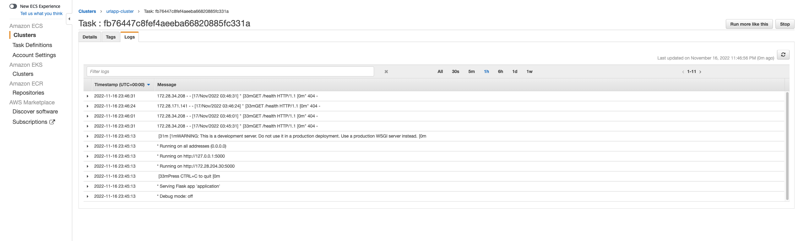

<h1?>Deployemnt 5</h1>

## Purpose of Deployemnt
The goal of this deployment was to:
- create an application using Docker, Terraform and push this application to ECS(Elastic Container Services)

## Observation
To acomplish this deployment, I went though the following actions:
1) Installed Jenkins, Docker, and Terraform on separate EC2s
2) After the creations on the EC2s, log into the Jenkins EC2 and assign the Docker and Terraform EC2s as agents
3) Created a Jenkinsfile that would:
- Build and test the application
- Using the Docker EC2, created an image with the Url-Shortener and all the dependancies installed already. Also pushed this image to DockerHub.
- Using the Terraform EC2, spins up an ECS (Elastic Container Service) Container which pulls the image we pushed to DockerHub and runs the Url-Shortener.

## Changes to Pipeline
#### Changing something on the apllication UI
By modifying the files in the `templates/home.html` `templates/your_page.html` `templates/base.html`, I was able to change the UI of the application.

Before:

After:

#### Adding More Tests
To test out some of the functionality of the application I created a few functions in the `test.py` to test the response code for each of the template pages and also to get a response code when inputing a URL that isn't in the application.

1) `test_home_page()` this function test to see when getting the `/home.html` URL, if it will get a 200 response code.

2) `test_URL_Page()` this function test to see when getting the `/your_url` URL, if it will get a 302 response code.

3) `test_error_page()` this function test to see when getting the `/x` or the `/page_not_found` URLs, if it will get a 404 response code.

#### A Way To Be Notified
To notify myself on any changes in the repository, i used the "watch" tab on the Github page.

## Errors Occured During Deployment
### exec /usr/local/bin/python3: exec format error
After deploying the images to ECS, my container was showing a pending status. When i looked into it, i got a error in my task definition logs stating `exec /usr/local/bin/python3: exec format error`. This error was created because I created my dockerfile on an Apple M1 chip.

To solve this issue, I edited my `FROM python` to `FROM --platform=linux/amd64 python:latest`

